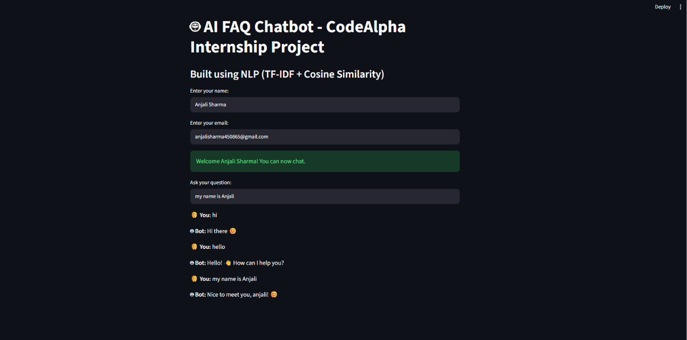

# 🤖 AI FAQ Chatbot

This is an AI-based chatbot built using Natural Language Processing (NLP).

## 🚀 Features
- FAQ-based chatbot using TF-IDF & Cosine Similarity
- Built with Streamlit (Web App)
- User input (Name & Email)
- Chat history
- Smart response system

## 🛠️ Technologies Used
- Python
- Streamlit
- Scikit-learn
- Pandas

## ▶️ How to Run

1. Install dependencies:
pip install -r requirements.txt

2. Run the app:
streamlit run app.py

## 📌 Project Info
This project was developed as part of CodeAlpha Internship.
## 📸 Project Preview

